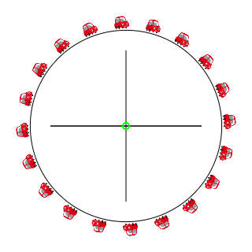
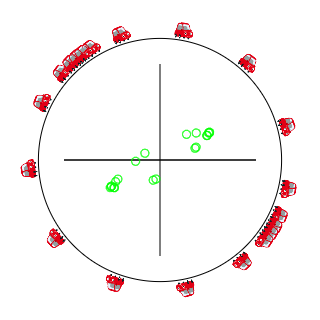
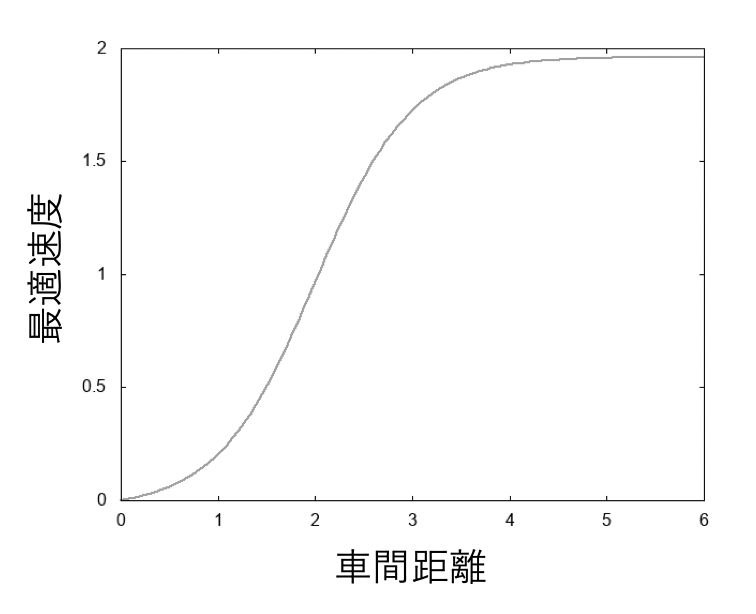
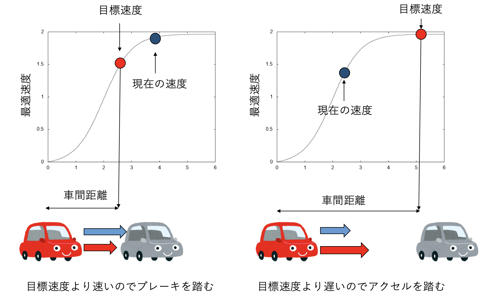
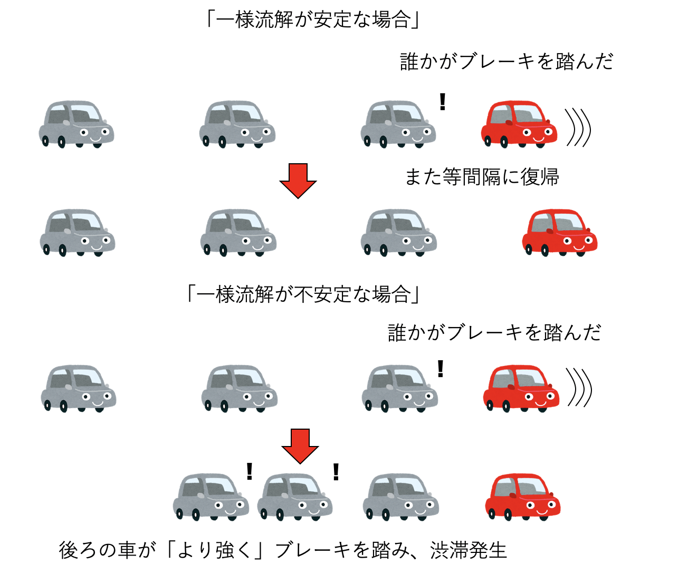
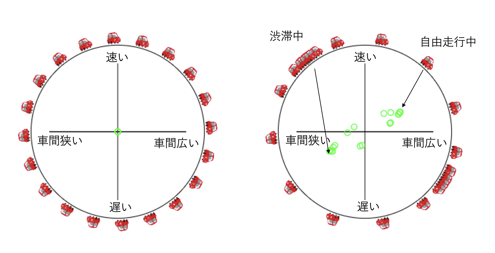
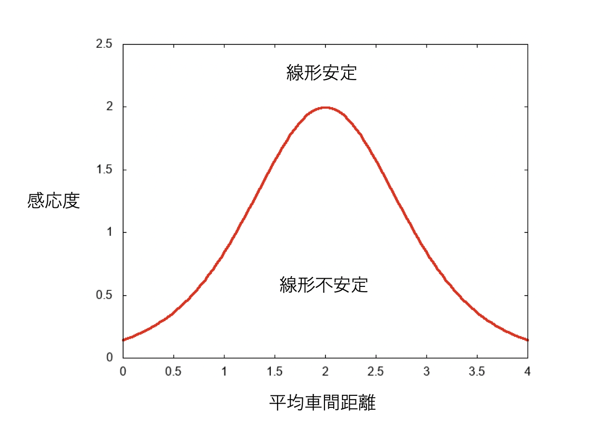

# 渋滞を再現する数理モデル「最適速度模型」を触ってみる

## はじめに

今年(2019年)のゴールデンウィークは10連休だそうで、高速道路が相当混むことが予想される。車での移動では、渋滞は頭の痛い問題だ。では、渋滞はなぜ起きるのだろうか？

よくう言われるのが「坂道が始まるところで渋滞が起きる」というものだ。坂道では知らないうちに車のスピードが落ちる。すると車間距離が縮まることで、後続の車がブレーキを踏み、それを見たさらに後ろの車がブレーキを・・・と連鎖して、最終的に渋滞になると説明される。また、ドライバーなら合流地点があったり、車線が狭くなるところなどでよく渋滞が起きることも経験的に知っているだろう。合流地点や車線が狭くなるところは流量が落ちるから詰まって渋滞になりやすそうである。

しかし、これらは「渋滞がどこで起きやすいか」ということを説明しているに過ぎず、「渋滞がなぜ起きるか？」ということの答えにはなっていない。そもそも渋滞はなぜ起きるのか？簡単なモデルで渋滞を再現、説明できないだろうか？

本稿では、渋滞を引き起こす簡単な数理モデルである「最適速度模型(Optimal Velocity Model)」について紹介する。

## オンラインシミュレータ

最適速度模型がどのようなモデルかを説明する前に、このモデルのオンラインシミュレータを作ったので、それを見て欲しい。

[https://kaityo256.github.io/ov_model/](https://kaityo256.github.io/ov_model/)

円周状のサーキットに、最初は等間隔に並んだ車が20台周回している。

しばらく見ていると、だんだん車間距離がばらついてきて、渋滞ができる。

上記の例では渋滞が二箇所発生しているが、十分時間が経過すると渋滞は一箇所にまとまると思う。中央の緑の点の意味については後述する。

## 最適速度模型

最適速度模型は、坂東らによって提案された交通流を表すモデルである[1,2]。具体的には、以下のような力学系として表現される。

$$
\begin{aligned}
\dot{x_i} &= v_i\\
\dot{v_i} &= a \left(V(x_{i+1}-x_i) - v_i\right)
\end{aligned}
$$

ここで、$x_i, v_i$はそれぞれ$i$番目の車の位置と速度である。関数$V(dx)$は、車間距離$dx$によって決まる「最適速度」を表し、例えば$\tanh$型の関数が用いられる。このシミュレータでは$V$として

$$
V(x) = \tanh(x - 2) + \tanh(2)
$$

を用いた。これは図示するとこんなグラフになる。

「最適速度」とは、「いま自分が目標とする速度」であり、車間距離が十分に空いている場合には最高速度(例えば高速自動車国道の本線車道なら時速100キロ)で走るが、車間距離が詰まってきたら目標速度を落とし、車間距離ゼロなら目標速度ゼロ、つまり停止する。

さて、「目標速度」と書いたのは、ドライバーがその速度を「目標」とするからだ。先程の力学系の速度の時間変化は以下のように表現されている。

$$
\dot{v_i} = a \left(V(x_{i+1}-x_i) - v_i\right)
$$

$x_{i+1}-x_i$は、前の車との車間距離であるから、$V(x_{i+1}-x_i)$は、その車間距離における目標速度である。そこから現在の速度$v_i$を引くと、「目標速度より現在の速度が遅いと正、速いと負」になる。それに$a$をかけたものが車の加速度となる。これは、車の以下の性質をモデル化したものだ。

1. 現在の速度が、車間距離から決まる目標速度よりも速ければブレーキを踏む
2. 現在の速度が、車間距離から決まる目標速度よりも遅ければアクセルを踏む

先の式に表れた$a$は感応度(Sensitivity)と呼ばれ、ドライバーの反射神経を表現するようなパラメータだ。$a$が大きいほど、目標速度への追随が早くなる。

## 渋滞が起きる理由

さて、この方程式系を見ると、全ての車が等間隔に並んでおり、かつその時の最適速度で走行していれば、加速度がゼロとなることがわかる。加速度がゼロなのだから速度は変化しない。これを「一様流解(uniform solution)」と呼ぶ。いま、車が一様流解に非常に近い状態で走行しているとしよう。しかし、ある車がちょっとだけブレーキを踏み、一様流解からずれたとする。この時、車間距離が十分長ければ、もしくはドライバーの反応速度が十分速ければ、すぐに一様流解に復帰できるだろう。しかし、車間距離が(ドライバーの反応速度に比べて)短かった場合、ある車がブレーキを踏むと、後続の車はより強くブレーキを踏み・・・と連鎖し、渋滞が形成される。つまり、最適速度模型では「渋滞は一様流解が不安定化して起きる」と理解される。

オンラインシミュレータの中央に表示されていたグラフは、横軸が「平均車間距離$\bar{dx}$からのずれ$\tilde{dx}_i$」、縦軸が「平均車間距離から決まる目標速度からのズレ$\tilde{v}_i$」を、それぞれの車についてプロットしたものだ。それぞれ数式で書くとこんな感じ。

$$
\begin{aligned}
\tilde{dx}_i &= x_{i+1} - x_i - \bar{dx}\\
\tilde{v}_i  &= v_i - V(\bar{dx})
\end{aligned}
$$

要するに「車間距離が平均より長ければ右、短ければ左へ」「速度が平均より速ければ上、遅ければ下へ」プロットされる。

したがって、全ての車が等間隔で同じ速度で走行していると、すべての点が中央に集まる(左図)。しかし、渋滞が発生すると、渋滞中の車に対応する点は左下へ、自由走行中の車は右上に描かれる。

このサーキットの「流量」は、ある地点を単位時間あたりに横切る車の数で表される。渋滞が発生すると、一番遅い速度でリミットされるため、流量が落ちてしまう。

さて、一様流解が安定か、不安定化は、一様流解から少しずれた時に、それを戻そうとするか、それともそのズレを拡大させようとするかで決まる(摂動に対する安定性)。この種のモデルでよく行われる線形安定性解析をすると、一様流解の安定性条件は以下で記述される。

$$
a > 2 V'(\bar{dx})
$$

つまり、平均車間距離、つまり一様流解の車間距離を$\bar{dx}$として、最適速度関数のその車間距離における微分係数の二倍$2V'(\bar{dx})$より、感応度が大きければ安定、小さければ不安定になる。図にするとこんな感じになる。

ここから、

* 車が多いほど(平均車間距離が小さいほど)
* ドライバーが鈍いほど(感応度が小さいほど)

一様流解が不安定となり、渋滞が起きやすいことがわかる。

## まとめ

渋滞を引き起こす簡単な数理モデル「最適速度模型」を紹介したい。最適速度模型の重要な性質は

* ドライバーは前しか見ない(非対称性)
* ドライバーの判断に遅れが伴う(遅延)

である。例えば車が前だけではなく後ろも気にするようになったり、ドライバーが瞬時に速度をコントロールできるような場合は渋滞は起きなくなる。この模型の面白いところは、渋滞を「相転移」として理解できることである。相転移とは、温度を下げると水が凍るといった現象である。温度を下げた時、水は不純物や容器の壁などから凍り始めるが、水が凍る本質は不純物や壁ではなく「その温度、圧力では液体は不安定であり、凍った方が安定である」という条件である。

同様に、最適速度模型によれば「渋滞が起きるのは、その密度、その反応速度では一様流解が不安定だからであり、坂道や合流は渋滞形成のきっかけに過ぎない」ということがわかる。

もし最適速度模型が実際の交通流の本質をよく捉えているとするならば、自動運転により速度調整が早くなったり、後ろの車も気にするようにしたら、渋滞が起きづらくなることになる。実際に実験なども行われているのだろうが、筆者は詳しくは知らない。

本稿を読んで交通流の数理に興味を持った方は、[交通流数理研究会](http://traffic.phys.cs.is.nagoya-u.ac.jp/~mstf/index.html)に参加してみると面白いかもしれない。交通流に限らず、細胞運動や歩行者流など、日常見られる様々な現象について数理的な研究を発表するシンポジウムが行われている。

## 参考文献

1. M. Bando, K. Hasebe, A. Nakayama, A. Shibata, and Y. Sugiyama, [Jpn. J. Ind. Appl. Math. 11, 203 (1994)](https://doi.org/10.1007/BF03167222).
2. M. Bando, K. Hasebe, A. Nakayama, A. Shibata, and Y. Sugiyama, [Phys. Rev. E 51, 1035 (1995)](https://doi.org/10.1103/PhysRevE.51.1035).
3. T. S. Komatsu, S. Sasa, [Phys. Rev. E 52 5574 (1995)](https://doi.org/10.1103/PhysRevE.52.5574).